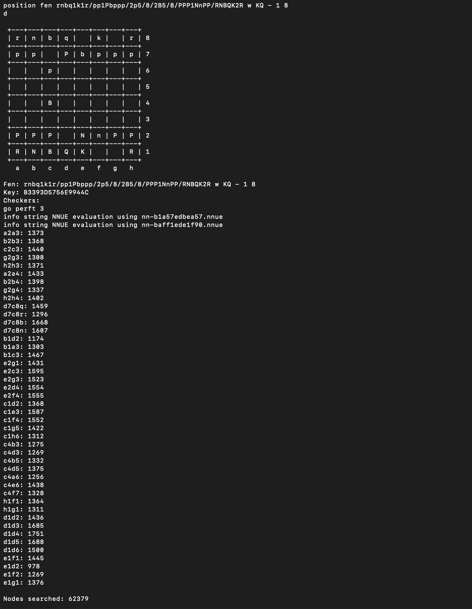
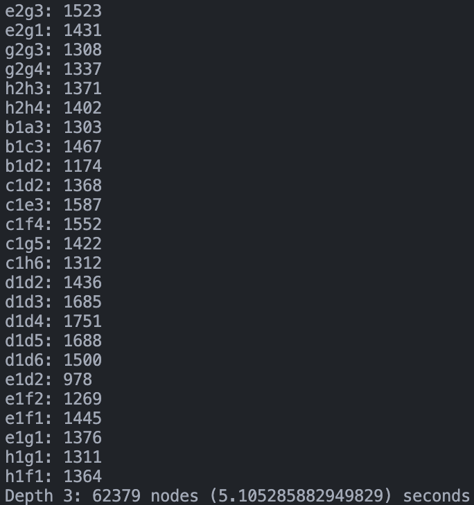
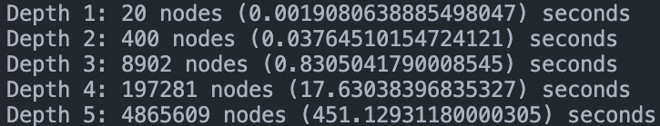
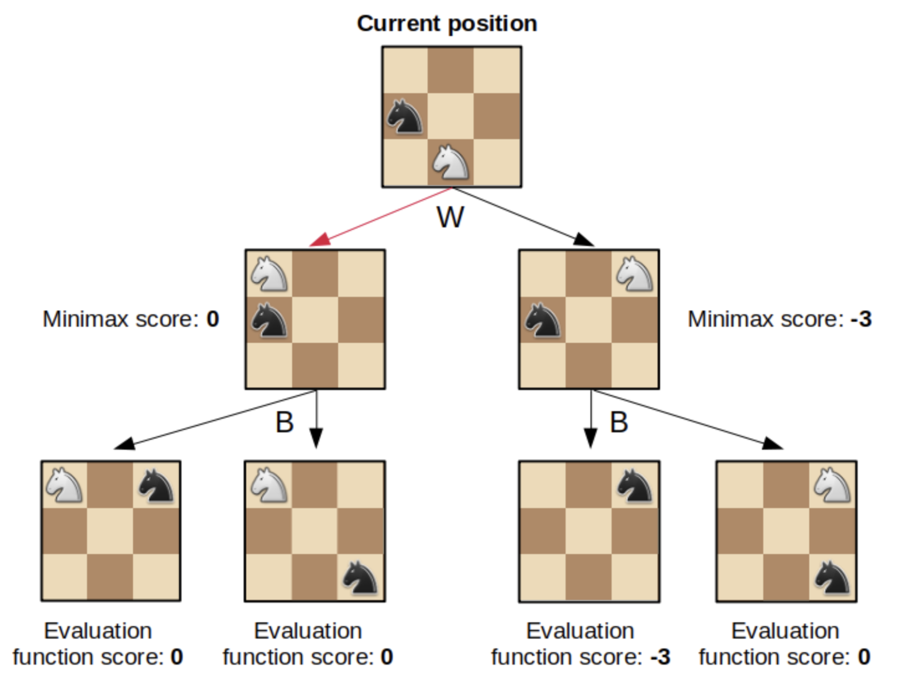
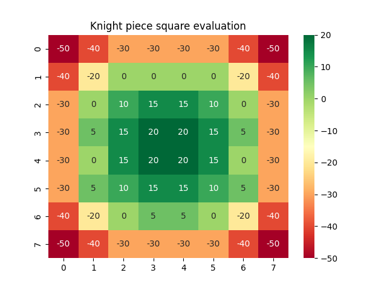

# Chess ♟️

A comprehensive chess implementation from scratch that includes all functionalities, such as en passant, castling, and pawn promotion. AI bots based on the minimax and alpha-beta algorithms were also created. Additionally, a Tkinter GUI provides a user-friendly interface for playing the game.

_User vs. AlphaBetaV2 AI bot (1.5x speedup)_

## Table of contents

-   [Motivation 💪](#motivation-💪)
-   [Installation 📦](#installation-📦)
-   [Playing Chess](#playing-chess)
-   [Development Process 👨‍💻](#development-process-👨‍💻)
    -   [Testing](#testing)
    -   [Optimization](#optimization)
    -   [Chess AI (Minimax algorithm)](#chess-ai-minimax-algorithm)
    -   [Alpha-Beta algorithm](#alpha-beta-algorithm)
    -   [Move Ordering](#move-ordering)
    -   [Piece square evaluation](#piece-square-evaluation)
    -   [Evaluating Bots](#evaluating-bots)
-   [What I have learned](#what-i-have-learned)
-   [Future work 🚀](#future-work-🚀)
-   [Cool Resources](#cool-resources)

## Motivation 💪

I have played chess casually on and off for a couple of years, and wanted to learn chess programming. Also, since I am not very good at chess, I thought it would be interesting to see if I could create an AI that could play better than me.

## Installation 📦

To install the required packages, use the following command: `pip install -r requirements.txt`

## Playing chess

To play a game of chess simply run:

`python3 main.py`

This will run the game with user input for both white and black player.

For both white and black player you can choose different player types:

-   User - User input
-   Random - Random legal moves
-   MiniMax - AI Bot based on minimax algorithm (default search tree depth = 2)
-   AlphaBeta - Minimax with alpha-beta pruning, making it faster (default search tree depth = 3)
-   AlphaBetaV2 - AlphaBeta, with piece square evaluation (default search tree depth = 3)

If you, as the white player, want to play against the AlphaBetaV2 bot you would run:

`python3 main.py User AlphaBetaV2`

## Development process 👨‍💻

I wanted to document my development process as it might be useful for anyone who might want to try a similar project themselves 😄

### Testing

Checking if a chess implementation is correct may seem difficult given the large number of different states a game can be in. Certain specific situations occur relatively rarely, such as en passant, castling, and pawn promotion.

A good way to test that the game logic is correct is to take a game state (FEN string) and calculate the number of different states you can end up at different depths. A depth here is defined as a move for one player, also known as a ply. One could look at this as a tree structure, where the nodes are game states and edges are the moves leading to those nodes. This testing method is known as [perft](https://www.chessprogramming.org/Perft).

For example, at the initial state of a chess game, white player has the possibility to make one of 20 different moves. This means that at a depth of 1, there are 20 nodes. Black player has the possibility of making the exactly the same number of moves regardless of white player's move, meaning that there are 20 x 20 = 400 possible states or nodes at 2 ply.

While this is a good starting point, it doesn't test the more intricate game states. These states usually occur in the middlegame and endgame, and to calculate the number of nodes more than a few depths can be computationally infeasible, as the number of nodes grows rapidly.

A better approach would therefore be to set the game to a middlegame or endgame state, and then calculate nodes at different depths from there. The Chess Programming Wiki has a [list of different perft results](https://www.chessprogramming.org/Perft_Results) which have been proven to be useful for debugging chess programs. These were used to debug my game logic. Below is a GIF of my program running through all possible states, with initial state perft position 5, and a depth of 2:

Once I found a discrepancy between the number of nodes calculated by my program, and the results on Chess Programming Wiki, I did the same calculations with [Stockfish](https://disservin.github.io/stockfish-docs/). Using Stockfish was very helpful since it outputs the number of leaf nodes for all nodes at depth 1. The example below shows the number of possible nodes for each game state that is possible from the start position (position 5):

I could then output the same info from my program:

Given this info I could find out what node(s) at depth 1 lead to the discrepancies. I did this by copying the output of Stockfish into `output/stockfish_output.txt` and my program's output into `output/my_program_output.txt`. I then ran `python3 compare_moves.py`, which gave me the nodes that had different number of leaf nodes between the outputs. I could then set such a node to my initial position and perform the calculations again. This was done by entering my initial position into a [FEN viewer website](https://www.dailychess.com/chess/chess-fen-viewer.php), perform the move that lead to a node with discrepancy, and set the new FEN string as the initial position.

For my program, these tests revealed a couple of bugs I was unaware of, mostly regarding castling.

All perfts from the Chess Programming Wiki can be run on my engine with the following command:

`python3 perft.py`

### Optimization

Now that the game logic had been thoroughly tested, it was time to optimize the code to run faster. This is especially important if one wants to create an AI chess bot, as it directly affects evaluation/training time.

At this point my code wasn't particulary fast 😅. The image below shows the number of nodes calculated from the starting position of a chess game:

To calculate the number of nodes at a depth of 5, it takes 7.5 minutes!

The most obvious way to speed up my chess program would be to change to a compiled language such as C or C#. This comes at the cost of development time. A reasonable solution would therefore be to use a JIT-compiler for my already developed code. However this proved to be challenging as Numba (the JIT library) lacks support a lot of Python functionality. Numba might be an option I revisit in the future.

I ended up optimizing the speed of my code by limiting the number of calculations and array accesses, and rather store more results in memory. There is almost always a space-time tradeoff in software programs, and I chose to optimize on time.

Running the perft tests was a good way to measure the speed of my code. Before optimization it took my code ~26 seconds to run the tests. I managed to reduce this to ~16 seconds, purely by rewriting my code.

### Chess AI (Minimax algorithm)

The chess AI was based on the minimax algorithm, which is what the world's strongest chess engine, Stockfish, is based on.

Minimax is a search algorithm that looks evaluates all possible states after a certain amount of moves (also called depth). For example, a depth of 2 would result in a tree of all of the possible moves for the player whose turn it is, and all possible respones for each of these moves for the opponent. The leaf nodes are evaluated using an evaluation function.

The first chess AI I created was based on this, and the evaluation function looked at the difference in material (pieces) between white and black.

_Image from [R-bloggers](https://www.r-bloggers.com/2022/07/programming-a-simple-minimax-chess-engine-in-r/)_

### Alpha-Beta algorithm

As the number of possible states of a game grows very fast with the depth, it would be helpful to be able to prune some states. This can be done with the alpha-beta algorithm, which is similar to the minimax algorithm, but with pruning, making it faster. Sebastian Lague has a [nice video](https://www.youtube.com/watch?v=l-hh51ncgDI) explaining both algorithms.

The standard minimax algorithm with a search tree depth of 3 took approximately 20 seconds to calculate one move, which is way too long. After implementing alpha-beta pruning one move on average took 5.6 seconds, meaning that the bot became nearly 4x faster!

### Move ordering

To make the chess AI faster, we want to prune as many branches as possible. To do this we could order the moves, so that we look at the best ones first. Typically these are moves that capture the opponents pieces.
By looking at at these moves first, the algorithm became roughly twice as fast!

### Piece square evaluation

Alpha-beta pruning makes the chess AI faster, but not any better. To improve the skills of the AI, we need to improve the evaluation function. In other words, the evaluation function needs to give a better estimate of truly how good a position is.

As a start we evaluated a state solely based on the material difference between the players. This is a simple but naive approach, as a lot of states (may be advantagous for black or white) may have the same material difference. A better approach would be to look at the positions of the different pieces. It is, for example, known that having control of the centre of the board is generally good, or that you want to avoid having knights on the edge of the board. We can incorprate this knowledge by using piece square evaulation tables. These tables lets us assign a value for each piece depending on their position. You could do this for all pieces for each player and look at the difference. I decided to add this difference to the evaluation function, and saw huge improvements in the skill level of the AI, especially in the opening play.

Below is a visualization of the piece square evaluation table for knights:

### Evaluating bots

Since the AI bots are based on a deterministic algorithms, each game they play against each other from the starting position are played out the same. Therefore, to evaluate their performance relalative to each other, I tested them against each other on 10 different (but roughly equal evaluation) positions. Two games were played with each position, so that both players played as white once.

AlphaBetaV2 vs. AlphaBeta (both with depth = 2) ended up with 8 wins for AlphaBetaV2 and 12 draws out of 20 matches, demonstrating the impact of piece square evaluation.

Below is the game between AlphaBeta (white) and AlphaBetaV2 (black) playing the French Defense.

## What I have learned

This was a challenging but fun project! Implementing chess and testing the chess engine was more time-consuming than first expected.

As a side note: I use Github Copilot in my daily work, but decided to disable it for this project. It undoubtebly made this project last longer, but I felt that I got a better grasp of the chess engine and AI algorithms when I had to implement and debug them on my own.

Through this project I have gotten a glimpse of the vast field of chess programming. It was also nice to refresh my knowledge on the minimax algorithm with alpha-beta pruning, and also implement enhancement such as move ordering 😄

All in all it was very rewarding (and a bit sad) to create an AI that is better than me at chess.

## Future work 🚀

In the future it would be interesting to:

-   Get an estimate of the ELO of the AI bots implemented.

-   Build an AI bot based on a ML approach, such as MCTS with Deep RL. This is the approach used by [AlphaZero](https://www.chessprogramming.org/AlphaZero#Network_Architecture). I have [implemented this technique before](https://github.com/AnmolS99/MCTS-Deep-RL) for the game of Hex, but it would be interesting to see how well it works for chess.

## Cool resources

Some cool resources I found while working on this project:

-   The book I have used to learn about minimax, alpha-beta, and AI in general: [_Russell, S. J., & Norvig, P. (2016). Artificial intelligence : a modern approach (3rd ed.; Global ed.). Pearson._](https://people.engr.tamu.edu/guni/csce421/files/AI_Russell_Norvig.pdf)
-   [Piece-Square Tables](https://www.chessprogramming.org/Simplified_Evaluation_Function)
-   [Video that inspired me to do this project](https://www.youtube.com/watch?v=U4ogK0MIzqk)
-   [Short video explaining how to program a chess engine](https://www.youtube.com/watch?v=w4FFX_otR-4)
-   [Website to analyse your chess games for free](https://chess.wintrcat.uk/)
